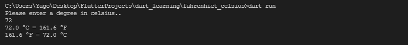

# A simple degree converter app

It first converts the value entered by the user in Celsius to Fahrenheit and then back to Celsius.

## Run

```
dart run
```

## Screenshots



## Contributing

Pull requests are welcome. Please tell me my mistake while correcting my mistakes.

#### Have a good day!

## License

[MIT](https://choosealicense.com/licenses/mit/)
