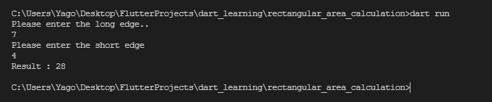

# Application to find the area of ​​a simple rectangle

## Run

```
dart run
```

## Screenshots



## Contributing

Pull requests are welcome. Please tell me my mistake while correcting my mistakes.

#### Have a good day!

## License

[MIT](https://choosealicense.com/licenses/mit/)
